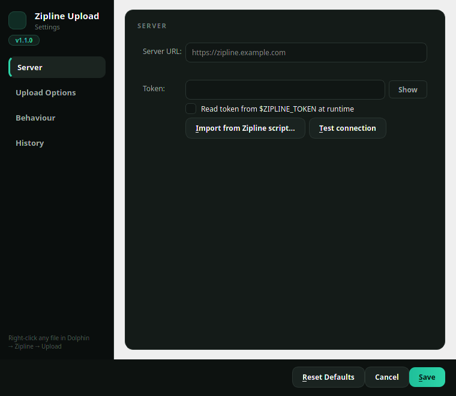
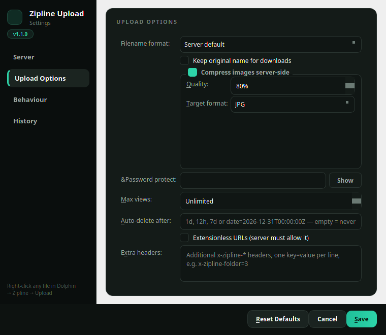
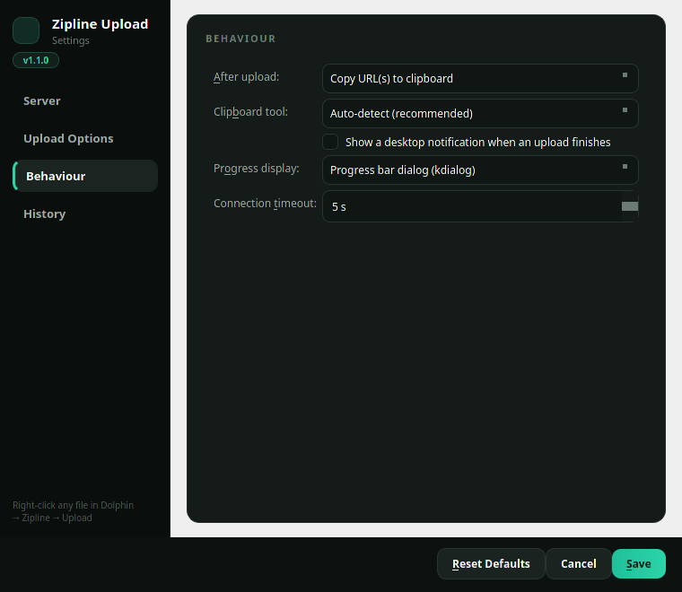

# Zipline Upload for Dolphin

A context-menu uploader for [Zipline](https://zipline.diced.sh) on **KDE Plasma 6** (Dolphin 24.x/25.x, KF6). Right-click a file in Dolphin → **Upload to Zipline**: the file is uploaded with a live progress bar (with a Cancel button), and the resulting URL is copied to your clipboard.

The upload worker is built entirely from the Python standard library and Plasma's own tools (`kdialog`, DBus, Klipper, `notify-send`) - **no pip dependencies**. The optional windowed settings GUI uses PySide6, downloaded to a private venv only if you ask for it.



## Features

- **Context Menu -** 2 **root-level context-menu entries** (no "Actions" submenu digging):   *Upload to Zipline* and *Configure Zipline uploads…*
- **Single or Multiple File Upload -** Upload one or many selected files (sequential, one progress bar overall).
- **Simple Settings GUI -** Themed configuration GUI  (Server / Upload Options / Behaviour / History) with live URL preview, script import, background-threaded connection test and an upload-history browser - offered as a one-time optional PySide6 download, with automatic fallback to kdialog menus so the addon never depends on it.
- **Upload Script Import -** Import a Zipline-generated shell uploader script - pulls the server URL, token and every `x-zipline-*` option out of it (supports generated scripts and the DIY `TOKEN=`/`URL=` style; older query-parameter scripts are folded into headers).
- **Upload Progress -** Live progress via a **kdialog progress bar** (including a working Cancel button) or a **Plasma notification with a progress bar**, or silent.
- **Post Upload -** Easy user configurable post-upload actions via a GUI: copy URL(s) to clipboard, open in browser, both, notification only, nothing.
- **Clipboard Handling -** Wayland/X11 clipboard handled automatically: **Klipper** (Plasma, works on both) → `wl-copy` (Wayland) → `xclip`/`xsel` (X11), or manual override available.
- **Native Zipline Upload Options -** Options for: filename format, original name, image, compression (percent + target format), password, max views, auto-delete, extensionless URLs, plus arbitrary extra `x-zipline-*` headers.
- **Connection Test -** Connection test that uploads (and cleans up) a small test file to ensure your server config is working.
- **Upload History -** Upload history at `~/.local/state/zipline-upload/history.jsonl`
- **Custom User Hooks -** Optional user hook (`~/.config/zipline-upload/hook.py`) for custom post-upload logic - see `examples/hook.py.example`
- **Initial Setup Automation -** the settings GUI opens automatically when you trigger an upload with no config

## Installing

### From the KDE Store (easiest)

Add store link here

**Dolphin** → **Hamburger Menu** → **Download New Service Menus…** → **Search** "Zipline" → **Install**. 

The archive extracts into `~/.local/share/kio/servicemenus/` and the menu is immediately available; the menu entries find the scripts through `$HOME`, so nothing else is needed. You can also download the tarball from the [KDE Store](https://store.kde.org) and extract it into that directory manually.

### From source

```sh
git clone https://github.com/kernel-panic-0/dolphin-zipline-upload && cd dolphin-zipline-upload
./install.sh
```

Installs per-user (no root): the scripts to `~/.local/share/zipline-upload/`, the service menu to `~/.local/share/kio/servicemenus/`, and (best-effort, needs network once) a private PySide6 venv so the settings open in the windowed GUI right away.

Uninstall with `./uninstall.sh` (covers both layouts; your settings are kept).

## First configuration

Either import the script Zipline generated for you (Settings → *Generate Uploaders* → *Shell Script*):

```sh
python3 ~/.local/share/zipline-upload/zipline-upload.py --import-script ~/Downloads/zipline-script-file.sh
```

…or configure interactively:

```sh
python3 ~/.local/share/zipline-upload/zipline-upload.py --configure
```

### The settings window

`--configure` opens a dark-themed Qt window with sidebar navigation (PySide6 from the addon's private venv; if the venv is missing it falls back to kdialog menus automatically - nothing breaks, it just looks more spartan).

**Server** - URL with a live preview of the resulting `/api/upload` endpoint, token (masked, with a Show toggle or the no-storage `$ZIPLINE_TOKEN` option), *Import from Zipline script…*, and *Test connection* (uploads and deletes a tiny probe file).


**Upload Options** - filename format, original-name keeping, server-side image compression (quality + target format), password protection, max views, auto-delete, extensionless URLs, and arbitrary extra `x-zipline-*` headers (folder IDs, custom filenames, …).



**Behaviour** - what happens after an upload (clipboard / browser / notification), which clipboard tool to use (auto-detect handles Wayland vs X11), progress display style, completion notifications, and timeouts.



**History** - your last 100 uploads from `history.jsonl`, with copy/open per row (double-click a row to copy its URL) and copy-all.

If you close with unsaved changes, the window asks whether to save, discard, or keep editing - same when you trigger an upload before ever configuring: the settings UI opens automatically, and the upload proceeds once you save.

## How uploads work

- `POST <server>/api/upload` with the `authorization` header, a streamed `multipart/form-data` body (memory use is flat regardless of file size), and your options as `x-zipline-*` headers - exactly what Zipline's own generated scripts send.
- Progress is byte-accurate because the body carries an exact `Content-Length`.
- MIME type detection uses `file --mime-type` when available (same as Zipline's own script), falling back to Python's `mimetypes`.
- Non-ASCII filenames are sent as RFC 5987 `filename*=UTF-8''…` so they survive server-side latin-1 header decoding.

## Wayland vs X11 clipboard

Auto-detect (default) tries, in order: **Klipper over DBus** (native Plasma clipboard - works on both display servers and needs nothing installed), then `wl-copy` under Wayland, then `xclip`/`xsel` under X11. If everything fails you'll get a critical notification containing the URL so nothing is lost. You can pin a specific tool in *Behaviour → Clipboard tool*.

## Security notes

- The token is stored only in `~/.config/zipline-upload/config.json`, created with `0600` permissions. If you prefer not to store it at all,
  choose *Use environment variable* `ZIPLINE_TOKEN` (and optionally `ZIPLINE_URL`) - they override the config at runtime.
- Only `http://` and `https://` URLs are accepted, and the "open in browser" post-upload action only opens http(s) URLs. Private/LAN/
  localhost hosts are deliberately **allowed** - self-hosted Zipline instances commonly run there.
- Only upload files you own to servers you trust; the token grants upload rights to your Zipline account.

## CLI reference

```
zipline-upload.py FILE [FILE …]    upload file(s) (what the menu runs)
zipline-upload.py --configure      open the settings GUI
zipline-upload.py --import-script PATH
                                    import + save a Zipline script's settings
zipline-upload.py --test           connection test (upload + delete probe)
zipline-upload.py --status         print current settings (token masked)
zipline-upload.py --quiet          suppress first-run notifications
zipline-upload.py --version
```

### Exit codes:

| Code  | Status            |
| ----- | ----------------- |
| `0`   | Success           |
| `1`   | Upload Error      |
| `2`   | Not Configured    |
| `130` | Cancelled by User |

## Files

| Path                                               | Purpose                              |
| -------------------------------------------------- | ------------------------------------ |
| `~/.config/zipline-upload/config.json`             | settings (0600, contains token)      |
| `~/.config/zipline-upload/hook.py`                 | optional post-upload hook            |
| `~/.local/state/zipline-upload/history.jsonl`      | upload history                       |
| `~/.local/state/zipline-upload/zipline-upload.log` | debug log                            |
| `~/.local/share/kio/servicemenus/`                 | menu (+ scripts, for Store installs) |
| `~/.local/share/zipline-upload/`                   | scripts + optional PySide6 venv      |

## License

See [LICENSE](LICENSE).
